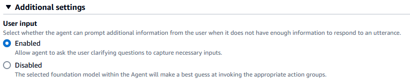
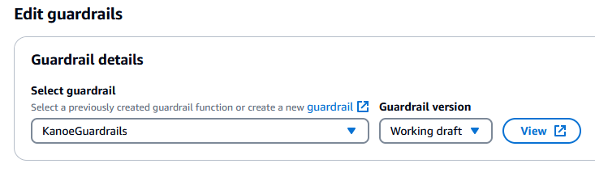

## Kanoe

This sample application demonstrates the use of Agents for Amazon Bedrock to use Generative AI and LLMs to orchestrate the integration of multiple APIs to coordinate the purchase of a flight for a member using their saved credit card and available reward dollars.

### Getting Started

- Install dependencies

  ```
  cd backend
  npm install
  cd frontend
  npm install
  ```

- Deploy environment

  ```
  npm run deploy        # for local environment
  npm run deploy-prod   # for production
  ```

- Edit the backend/.env to include the `CERTIFICATE_ARN` and `SENDER_EMAIL`

  ```
  CERTIFICATE_ARN=
  SENDER_EMAIL=
  ```

- Edit the frontend/.env.development to include the outputs from the deployed stacks
  ```
  VITE_REGION=
  VITE_API_ENDPOINT=
  VITE_API_WEBSOCKET_ENDPOINT=
  VITE_USER_POOL_ID=
  VITE_USER_POOL_CLIENT_ID=
  ```

#### Manual post-deployment steps

1. In the AWS console for the Bedrock Agent, set the User input under Additional settings to `Enabled`
   

2. In the AWS console for the Bedrock Agent, add the Guardrail to the Agent
   

3. Prepare the Agent

#### Common Errors

If you receive a Cloudformation error when deploying the stack, comment out portions of the resources in kanoe-stack.ts and deploy incrementally.

### References

- [Agents for Bedrock Documentation](https://docs.aws.amazon.com/bedrock/latest/userguide/agents.html)
- [ReInvent Video on Agents](https://www.youtube.com/watch?v=JNZPW82uv7w&list=WL&index=13&t=2172s)

##### IaC for Bedrock

- [AWSLabs Generative AI CDK Constructs](https://github.com/awslabs/generative-ai-cdk-constructs)
- [Bedrock Agents CDK Construct](https://github.com/PieterjanCriel/bedrock-agents-cdk/blob/main/lib/agentStack.ts)

##### Other References

- [Example using Amazon Generative AI Constructs](https://github.com/leegilmorecode/serverless-amazon-bedrock-agents/tree/main)
- [Amazon Bedrock Generative AI Constructs announcement](https://aws.amazon.com/events/?sc_icampaign=aware_aws-events&sc_ichannel=ha&sc_icontent=awssm-2021_event&sc_iplace=blog-sidebar&trk=ha_awssm-2021_event)

- [Example using Console to create Bedrock Agents](https://github.com/aws-samples/agentsforbedrock-retailagent/tree/main)
- [Example of follow up prompt (using Lex instead of Bedrock Agents)](https://aws.amazon.com/blogs/machine-learning/build-generative-ai-agents-with-amazon-bedrock-amazon-dynamodb-amazon-kendra-amazon-lex-and-langchain/)
